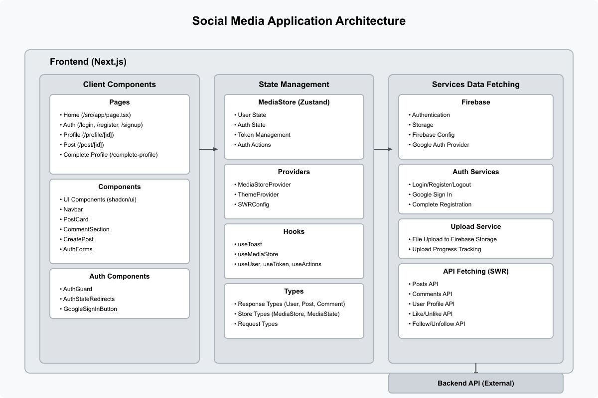

# Social Media Application Documentation

## Table of Contents
1. [Introduction](#introduction)
2. [Technology Stack](#technology-stack)
3. [Project Structure](#project-structure)
4. [Getting Started](#getting-started)
5. [Authentication](#authentication)
6. [State Management](#state-management)
7. [Components](#components)
8. [Routing](#routing)
9. [API Integration](#api-integration)
10. [File Uploads](#file-uploads)
11. [Theme System](#theme-system)

## Introduction

This social media application is a modern web platform built with Next.js. It provides features like user authentication, profile management, posting content, commenting, and interactions (likes, follows).



## Technology Stack

The application uses the following technologies:

- **Frontend Framework**: Next.js 15
- **Language**: TypeScript
- **UI Components**: Custom components built on shadcn/ui (Radix UI)
- **Styling**: Tailwind CSS
- **State Management**: Zustand
- **Authentication**: Firebase Auth
- **File Storage**: Firebase Storage
- **Data Fetching**: SWR
- **Animation**: Framer Motion
- **Form Management**: React Hook Form with Zod validation

## Project Structure

The application follows a modular architecture with these main sections:

```
src/
├── app/              # Next.js App Router pages
├── components/       # Reusable UI components
├── hooks/            # Custom React hooks
├── lib/              # Utility functions
├── providers/        # Context providers
├── services/         # External services (Firebase, etc.)
├── store/            # Zustand store
├── styles/           # Global styles
├── types/            # TypeScript type definitions
└── utils/            # Helper utilities
```

## Getting Started

### Prerequisites

- Node.js 18+ and npm/yarn
- Firebase project with Authentication and Storage enabled

### Installation

1. Clone the repository
2. Install dependencies:
   ```bash
   npm install
   ```
3. Set up environment variables in `.env.local`:
   ```
   NEXT_PUBLIC_API_URL=your_backend_api_url
   ```
4. Update Firebase configuration in `src/services/firebase.ts`
5. Start the development server:
   ```bash
   npm run dev
   ```
   The application will be available at http://localhost:4000

## Authentication

The application uses Firebase Authentication with multiple strategies:

- Email/Password authentication
- Google Sign-In
- JWT token management for API requests

### Auth Flow

1. **Registration**:
   - User registers with email/password or Google
   - Firebase creates the account
   - Backend registration is required to complete profile

2. **Login**:
   - User authenticates with Firebase
   - Token is stored in session storage
   - User state is updated based on backend profile

3. **Auth Guards**:
   - `AuthStateRedirects` component handles redirects based on auth state
   - Routes are protected based on authentication status

4. **Auth States**:
   - `idle`: Initial state
   - `loading`: Authentication in progress
   - `authenticated`: User is fully authenticated
   - `unauthenticated`: User is not logged in
   - `registration_required`: Firebase auth complete, profile setup needed

## State Management

The application uses Zustand for state management with the following features:

### MediaStore

Main store located in `src/store/index.ts` with:

- **User state**: Current user profile information
- **Authentication state**: Login status and token management
- **Actions**: Methods for login, register, logout, profile updates

### Store Usage

```typescript
// Using store selectors
const user = useUser();
const token = useToken();
const actions = useActions();
const authStatus = useAuthStatus();

// Example: Login action
await actions.login(email, password);
```

## Components

The application uses a component-based architecture built on shadcn/ui:

### Core Components

- **Navbar**: Main navigation component
- **PostCard**: Displays post content with interaction options
- **CreatePost**: Form to create new posts with media upload
- **CommentSection**: Displays and manages post comments
- **ProfileForm**: Profile creation and editing
- **AuthForm**: Login and registration

### UI Components

Reusable UI components based on Radix UI:
- Button, Card, Dialog, Avatar, Input, Textarea, Toast, etc.

## Routing

The application uses Next.js App Router with the following routes:

- `/`: Home feed
- `/login`: Login page
- `/register` or `/signup`: Registration page
- `/complete-profile`: Profile creation after registration
- `/profile/[id]`: User profile page
- `/post/[id]`: Individual post page with comments

## API Integration

### Fetcher Function

The application uses a custom fetcher (`src/utils/fetcher.ts`) for API requests:

```typescript
// Example API call
const data = await fetcher({
  method: "GET",
  path: "/api/v1/posts",
  token: token.idToken
});
```

### SWR Integration

Data fetching and caching is handled with SWR:

```typescript
// Example SWR usage
const { data, error, mutate } = useSWR(
  [`/api/v1/posts/${id}`, token],
  ([url, token]) => fetcher({ method: "GET", path: url, token: token.idToken })
);
```

## File Uploads

The application supports file uploads for posts and profile pictures using Firebase Storage:

```typescript
// Example upload
const mediaUrl = await uploadFile(file, "post-images", (progress) => {
  console.log(`Upload progress: ${progress}%`);
});
```

## Theme System

The application supports light/dark theme modes using `next-themes`:

- Theme toggling via the `ThemeToggle` component
- CSS variables for theme colors in `globals.css`
- System preference detection

## Key Features

1. **Social Feed**: View and interact with posts from all users
2. **Post Creation**: Create posts with text and optional images
3. **Commenting**: Add and view comments on posts
4. **Likes**: Like/unlike posts and comments
5. **User Profiles**: View and edit user profiles
6. **Following**: Follow/unfollow other users
7. **Responsive Design**: Mobile and desktop layouts